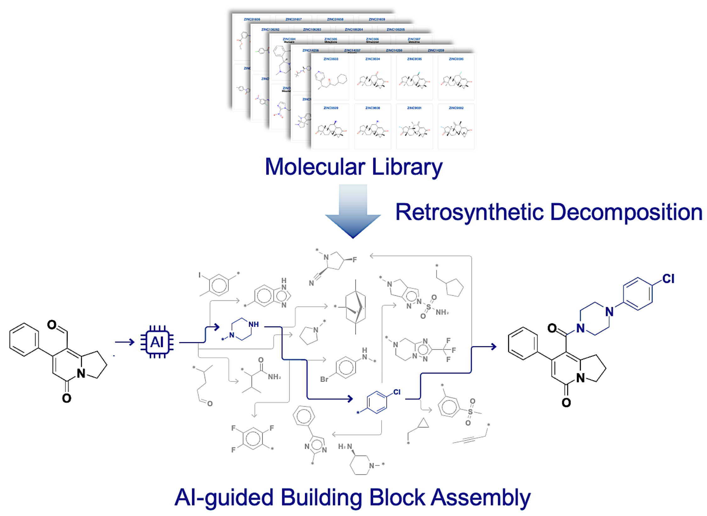

# Molecular generative model via retrosynthetically prepared chemical building block assembly

**Advanced Science** [[Paper](https://doi.org/10.1002/advs.202206674)] [[arXiv](https://arxiv.org/abs/2111.12907)]

Official github of ***Molecular generative model via retrosynthetically prepared chemical building block assembly*** by Seonghwan Seo\*, Jaechang Lim, Woo Youn Kim. (*Advanced Science*)

This repository is improved version(BBARv2) of [jaechang-hits/BBAR-pytorch](https://github.com/jaechang-hits/BBAR-pytorch) which contains codes and model weights to reproduce the results in paper. You can find the updated architectures at [`architecture/`](/architecture).

If you have any problems or need help with the code, please add an issue or contact [shwan0106@kaist.ac.kr](mailto:shwan0106@kaist.ac.kr).



### Citation

```
@article{seo2023bbar,
  title = {Molecular Generative Model via Retrosynthetically Prepared Chemical Building Block Assembly},
  author = {Seo, Seonghwan and Lim, Jaechang and Kim, Woo Youn},
  journal = {Advanced Science},
  volume = {10},
  number = {8},
  pages = {2206674},
  doi = {https://doi.org/10.1002/advs.202206674},
  url = {https://onlinelibrary.wiley.com/doi/abs/10.1002/advs.202206674},
}
```


## Table of Contents

- [Installation](#installation)
- [Data](#data)
  - [Dataset Structure](#dataset-structure)
  - [Prepare Your Own Dataset](#prepare-your-own-dataset)
  - [Preprocess](#preprocess)
- [Model Training](#model-training)
  - [Training](#training)
- [Generation](#generation)

## Installation

The project can be installed by pip with `--find-links` arguments for torch-geometric package.

```bash
pip install -e . --find-links https://data.pyg.org/whl/torch-2.3.1+cu121.html # CUDA
pip install -e . --find-links https://data.pyg.org/whl/torch-2.3.1+cpu.html # CPU-only
```


## Data

### Dataset Structure

Initially, the structure of directory `data/` is as follows. Please unzip the necessary data with `tar -xzvf` commands.

```bash
├── data/
    ├── ZINC.tar.gz         (Constructed from https://github.com/wengong-jin/icml18-jtnn)
    ├── 3CL_ZINC.tar.gz     (Smina calculation result. (ligands: ZINC15, receptor: 7L13))
    └── LIT-PCBA.tar.gz     (ZINC20 UniDock calculation result against 15 LIT-PCBA targets)
```

- `data/ZINC`, `data/3CL_ZINC` : Dataset which used in our paper.

### Prepare Your Own Dataset

For your own dataset, you need to prepare `data.csv` as follows.

- `./data/<OWN-DATA>/data.csv`

  ```
  KEY,SMILES,Property1,Property2,...
  1,c1ccccc1,10.25,32.21,...
  2,C1CCCC1,35.1,251.2,...
  ...
  ```

  - `KEY` field is optional.
  - `SMILES` field must be RDKit-readable.
  - If you want to train a single molecule set with different properties, you don't have to configure datasets separately for each property. You need to configure just one dataset file which contains all of property information. For example, `ZINC/data.csv` contains information about `mw`, `logp`, `tpsa`, `qed`, and you can train the model with property or properties, e.g. `mw`, `[mw, logp, tpsa]`.

### Preprocess

You need to preprocess dataset. Go to root directory and run `./script/preprocess.py`.

```shell
cd <ROOT-DIR>
python ./script/preprocess.py \
  --data_dir ./data/<DATA-DIR> \
  --cpus <N-CPUS> \
  --split_ratio 0.9  # train:val split ratio.
```

After preprocessing step, the structure of directory `data/` is as follows.

```bash
├── data/
    ├── <DATA-DIR>/
        ├── data.csv
        ├── valid_data.csv  new!
        ├── data.pkl        new!
        ├── library.csv     new!
        └── split.csv       new!
```

## Model Training

The model training requires less than <u>*12 hours*</u> for 200k steps with 1 GPU(RTX2080) and 4 CPUs(Intel Xeon Gold 6234).

### Training

```shell
cd <ROOT-DIR>
python ./script/train.py -h
```

Training Script Format Example

Our training script reads model config files `./config/model.yaml`. You can change model size by modifying or creating new config files. You can find another arguments through running with `-h` flag.

```shell
python ./script/train.py \
    --name <exp-name> \
    --exp_dir <exp-dir-name> \          # default: ./result/
    --property <property1> <property2> ... \
    --max_step 100000 \                 # default: 100k; for paper, we used 200k.
    --data_dir <DATA-DIR> \             # default: ./data/ZINC/
    --model_config <model-config-path>  # default: ./config/model.yaml
```

Example running script

```shell
python ./script/train.py \
    --name 'logp-tpsa' \
    --exp_dir ./result/ZINC/ \
    --data_dir ./data/ZINC/ \
    --property logp tpsa

python ./script/train.py \
    --name '3cl_affinity' \
    --exp_dir ./result/3cl_affinity/ \
    --data_dir ./data/3CL_ZINC/ \
    --property affinity

python ./script/train.py \
    --name 'litpcba-ADRB2' \
    --exp_dir ./result/LIT-PCBA/ \
    --data_dir ./data/LIT-PCBA/ \
    --property ADRB2 QED
```


## Generation

The model generates 20 to 30 molecules per 1 second with 1 CPU(Intel Xeon E5-2667 v4).

### Download Pretrained Models.

```shell
# Download Weights of pretrained models. (mw, logp, tpsa, qed, 3cl-affinity)
# Path: ./test/pretrained_model/
cd <ROOT-DIR>
sh ./download-weights.sh
```

### Generation

```shell
cd <ROOT-DIR>
python ./script/sample_denovo.py -h
python ./script/sample_scaffold.py -h
```

Example running script.

```shell
# Output directory path
mkdir ./result_sample

# De novo generation.
python ./script/sample_denovo.py \
    -g ./test/generation_config/logp.yaml \
    -n 100 \
    --logp 6 \
    -o ./result_sample/logp-6-denovo.smi \
    --seed 0

# Scaffold-based generation. => use `-s` or `--scaffold`
python ./script/sample_scaffold.py \
    -g ./test/generation_config/logp.yaml \
    -s "c1ccccc1" \
    -n 100 \
    --logp 2 \
    -o ./result_sample/logp-2-scaffold.smi

# Scaffold-based generation. (From File) => use `-S` or `--scaffold_path`
python ./script/sample_scaffold.py \
    --generator_config ./test/generation_config/mw.yaml \
    --scaffold_path ./test/start_scaffolds.smi \
    --num_samples 100 \
    --mw 300 \
    --o ./result_sample/mw-300-scaffold.smi \
    --seed 0 -q
```

Generator config (Yaml)

- generator config format (`./config/generator.yaml`)

  ```yaml
  # If library_builtin_model_path is not null, generator save or load library-builtin model.
  # The library-builtin model contains model parameters and library information.
  # 	(library information: SMILES and latent vector of building block)
  # During configuration process of generator, model vectorizes all building blocks in library.
  # This process requires about 30 seconds. With library-builtin model, this process is skipped.
  # When the file `library_builtin_model_path` exists, upper two parameters (`model_path`, `library_path`) are not needed.
  model_path: <MODEL_PATH>
  library_path: <LIBRARY_PATH>
  library_builtin_model_path: <LIBRARY_BUILTIN_MODEL_PATH>  # optional
  
  # Required
  window_size: 2000
  alpha: 0.75
  max_iteration: 10
  ```

- Example (`./test/generation_config/logp.yaml`)

  ```yaml
  model_path: ./test/pretrained_model/logp.tar
  library_path: ./data/ZINC/library.csv
  library_builtin_model_path: ./test/builtin_model/logp.tar
  
  window_size: 2000
  alpha: 0.75
  max_iteration: 10
  ```

